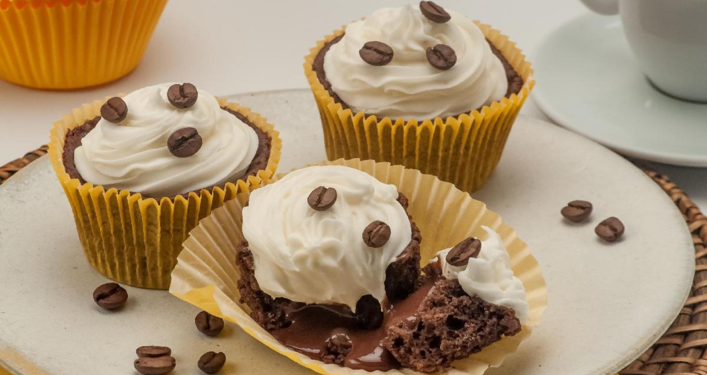

# 📖 Recipe Logbook — Cupcake de Café com Chantilly

<p align="center">
  
</p>

Este é um projeto de estudos desenvolvido para praticar conceitos fundamentais de desenvolvimento web front-end, focado em **HTML5 semântico** e **CSS3 moderno**. O projeto apresenta uma página de receita elegante, responsiva e com um design visualmente atraente para um delicioso **Cupcake de café com chantilly**.

---

## 🚀 Tecnologias Utilizadas

O projeto foi construído utilizando tecnologias web nativas para garantir simplicidade e alta performance:

*   **HTML5:** Estruturação semântica da página (`<main>`, `<section>`, `<ul>`, `<footer>`, etc.).
*   **CSS3:** Estilização avançada, uso de Flexbox para alinhamentos, responsividade com Media Queries e efeitos visuais modernos.
*   **Google Fonts:** Utilização da fonte serifada **Alice** para uma tipografia clássica e legível.
*   **CSS Reset:** Arquivo de reset customizado para garantir consistência de renderização entre diferentes navegadores.

---

## 🎨 Características do Projeto

*   **Responsividade Completa:** O layout se adapta perfeitamente de telas menores (dispositivos móveis ocupando 90% da largura) até telas maiores (computadores e tablets ocupando 50% de largura).
*   **Efeito Glassmorphism:** O plano de fundo do `body` utiliza um filtro de desfoque (`backdrop-filter: blur(10px)`) sobreposto a uma cor semitransparente baseada no tom principal do cupcake, criando uma sensação moderna de profundidade.
*   **Semântica Forte:** Código limpo e acessível, ideal para boas práticas de SEO e leitores de tela.
*   **Design Clean e Aconchegante:** Paleta de cores quente e harmoniosa baseada em tons de marrom e bege (`#F0E8C2`, `#291B1A`, `#573A37`), combinando perfeitamente com a temática de café.

---

## 📂 Estrutura do Repositório

```text
├── index.html         # Estrutura principal da página
├── public/            # Imagens e ícones utilizados no projeto
│   ├── cupcake-image.png
│   └── heart-icon.svg
└── style/             # Arquivos de estilização CSS
    ├── main.css       # Regras visuais e de layout principais
    └── reset.css      # Limpeza de estilos padrões dos navegadores
```

---

## 💻 Como Visualizar o Projeto

Por ser um projeto puramente estático (Vanilla HTML/CSS), você não precisa de nenhum compilador ou instalador de pacotes.

1.  Faça o clone ou baixe este repositório:
    ```bash
    git clone https://github.com/obrunofeitosa/Rocketseat-Recipe-Logbook.git
    ```
2.  Navegue até a pasta do projeto.
3.  Abra o arquivo `index.html` diretamente em qualquer navegador web de sua preferência (Chrome, Firefox, Edge, Safari, etc.) ou utilize a extensão **Live Server** no VS Code para desenvolvimento em tempo real.

---

## 🧑‍💻 Autor

Feito com ❤️ por **Bruno** como parte de sua jornada de aprendizado na **Rocketseat**.
